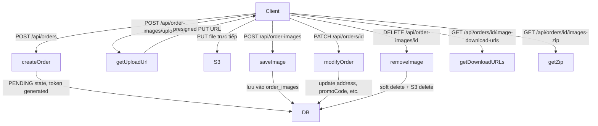

# Full Order Feature Implementation

## Phân tích so sánh Firebase cũ vs Codebase hiện tại

Codebase hiện tại đã có:

- `POST /api/orders` — tạo order (thiếu: copy address từ profile, appVersion, token generation)
- `GET /api/orders/[id]` — lấy order (thiếu: token-based access cho guest)
- `POST /api/order-images/upload-url` — lấy presigned S3 URL (auth bị hardcode)
- `POST /api/order-images` — save image path (auth bị hardcode, thiếu named collections)
- `GET /api/order-images` — list images với download URLs

Cần implement thêm:

- `PATCH /api/orders/[id]` — modifyOrder
- `DELETE /api/order-images/[id]` — removeImageFromOrder
- `GET /api/orders/[id]/image-download-urls` — getOrderImageDownloadURLs
- `GET /api/orders/[id]/images-zip` — getOrderImagesZIPDownloadURL
- `POST /api/orders/[id]/set-shipped` (admin) — setOrderStatesToShipped
- `GET /api/orders` (admin) — searchOrders
- `DELETE /api/orders/[id]` (admin) — deleteOrder
- Named image collections (thay vì chỉ 'default')
- Fix hardcoded token trong 2 routes hiện có
- Order token-based access (guest checkout)

## Flow tổng quan

## Chi tiết các thay đổi

### 1. DB Migrations mới (src/libs/migrations-registry.ts)

Thêm migrations 036–037:

- **036**: Thêm cột `token` vào bảng `orders` (guest access token)
- **037**: Thêm cột `search_terms` vào bảng `orders` (full-text search)

> Bảng `order_image_collections` đã có sẵn, không cần migration thêm.

### 2. Common Models (common/models/orders/orders-model.ts)

Mở rộng `OrderRow` và thêm types mới:

- Thêm `token: string` vào `OrderRow`
- Thêm `search_terms: string` vào `OrderRow`
- **ModifyOrderRequest**: `{ id, token?, fullName?, email?, address?, promoCode?, appVersion?, tileSize? }`
- **ModifyOrderResponse = OrderRow**
- **RemoveOrderImageRequest**: `{ orderId, imageId, token? }`
- **GetOrderImageDownloadUrlsRequest**: `{ id, token?, quality? }`
- **GetOrderImageDownloadUrlsResponse**: `Record<string, string>`
- **GetOrderImagesZipRequest**: `{ id, token?, format? }`
- **GetOrderImagesZipResponse**: `{ downloadUrl: string }`
- **SearchOrdersRequest**: `{ search: string }`
- **SetOrdersShippedRequest**: `{ ids: string[] }`

### 3. API Definitions (common/models/orders/orders-api-model.ts)

Thêm các API definitions mới:

- `API_MODIFY_ORDER` — PATCH `/api/orders/:id`
- `API_DELETE_ORDER` — DELETE `/api/orders/:id`
- `API_REMOVE_ORDER_IMAGE` — DELETE `/api/order-images/:id`
- `API_GET_ORDER_IMAGE_DOWNLOAD_URLS` — GET `/api/orders/:id/image-download-urls`
- `API_GET_ORDER_IMAGES_ZIP` — GET `/api/orders/:id/images-zip`
- `API_SEARCH_ORDERS` — GET `/api/orders?search=...`
- `API_SET_ORDERS_SHIPPED` — POST `/api/orders/set-shipped`

### 4. Repository Layer

**[src/repositories/orders.repository.ts](src/repositories/orders.repository.ts)** — thêm methods:

- `update(id, data)` — UPDATE orders SET ... WHERE id = $1
- `softDelete(id)` — UPDATE orders SET deleted_at = NOW()
- `findBySearchTerms(search)` — WHERE search_terms ILIKE '%term%'
- `findManyByIds(ids)` — WHERE id = ANY($1)
- `setShipped(ids)` — UPDATE ... SET state = 'shipped'

**[src/repositories/order-images.repository.ts](src/repositories/order-images.repository.ts)** — thêm methods:

- `findByCollectionName(orderId, collectionName)` — lấy collection theo tên
- `findOrCreateCollection(orderId, name)` — upsert collection
- `findById(id)` — lấy image by id
- `softDelete(id)` — UPDATE order_images SET deleted_at = NOW()
- `findByOrderIdWithCollections(orderId)` — join với collections

### 5. Service Layer

**[src/services/orders.service.ts](src/services/orders.service.ts)** — thêm methods:

- `modifyOrder(id, userId, data)` — validate token/user, update fields, recalculate price
- `deleteOrder(id)` — soft delete
- `searchOrders(search)` — find by search terms
- `setOrdersShipped(ids)` — bulk update state

**[src/services/order-images.service.ts](src/services/order-images.service.ts)** — cập nhật:

- `getUploadUrl` — hỗ trợ `collectionName` thay vì chỉ default
- `saveImage` — hỗ trợ `collectionName` để upsert collection theo tên
- `removeImage(orderId, imageId)` — soft delete + xóa S3
- `getDownloadUrls(orderId)` — trả về `Record<imageId, downloadUrl>`
- `getImagesZip(orderId, format)` — zip files từ S3

### 6. API Route Handlers mới/cập nhật

**Fix hardcoded token:**

- `[src/app/api/order-images/upload-url/route.ts](src/app/api/order-images/upload-url/route.ts)` — khôi phục cookie auth
- `[src/app/api/order-images/route.ts](src/app/api/order-images/route.ts)` — khôi phục cookie auth

**Cập nhật:**

- `src/app/api/orders/[id]/route.ts` (mới) — GET (với token support) + PATCH (modifyOrder) + DELETE (admin)

**Mới:**

- `src/app/api/order-images/[id]/route.ts` — DELETE (removeImage)
- `src/app/api/orders/[id]/image-download-urls/route.ts` — GET
- `src/app/api/orders/[id]/images-zip/route.ts` — GET
- `src/app/api/orders/set-shipped/route.ts` — POST (admin)
- `src/app/api/orders/route.ts` — thêm GET (search, admin)

### 7. Frontend Layer

**[src/shared/apis/order-images.ts](src/shared/apis/order-images.ts)** — thêm:

- `removeOrderImage(id)`
- `getOrderImageDownloadUrls(orderId, quality?)`
- `getOrderImagesZip(orderId, format?)`

**[src/shared/apis/orders.ts](src/shared/apis/orders.ts)** (mới hoặc cập nhật):

- `getOrder(id, token?)`
- `modifyOrder(id, data)`
- `deleteOrder(id)` (admin)
- `searchOrders(search)` (admin)
- `setOrdersShipped(ids)` (admin)

**[src/shared/hooks/data/order-images.ts](src/shared/hooks/data/order-images.ts)** — thêm hooks:

- `useRemoveOrderImageMutation`
- `useGetOrderImageDownloadUrlsQuery`
- `useGetOrderImagesZipMutation`

**[src/shared/hooks/data/orders.ts](src/shared/hooks/data/orders.ts)** (mới hoặc cập nhật):

- `useQueryOrder(id)`
- `useModifyOrderMutation`
- `useDeleteOrderMutation` (admin)
- `useSearchOrdersQuery` (admin)
- `useSetOrdersShippedMutation` (admin)

## Lưu ý quan trọng

- **Token-based access**: `orders.token` column cần được generate khi tạo order (`crypto.randomUUID()`). Client lưu token này và gửi trong header hoặc body để truy cập order mà không cần đăng nhập.
- **Named collections**: Khi `collectionName` được truyền vào upload-url và save-image, dùng `findOrCreateCollection(orderId, name)` thay vì collection 'default'.
- **Soft delete ảnh**: `removeImage` set `deleted_at = NOW()` trong DB, sau đó xóa file trên S3 (ignore lỗi nếu file chưa upload).
- **ZIP download**: Dùng `archiver` hoặc `jszip` npm package để zip files download từ S3 về server rồi stream về client.
- **Admin check**: Dùng `user.role === 'admin'` (field đã có trong `auth_users`).
- **Search terms**: Concatenate các fields (email, name, id) với lowercase và lưu vào `search_terms` column khi tạo/update order.

