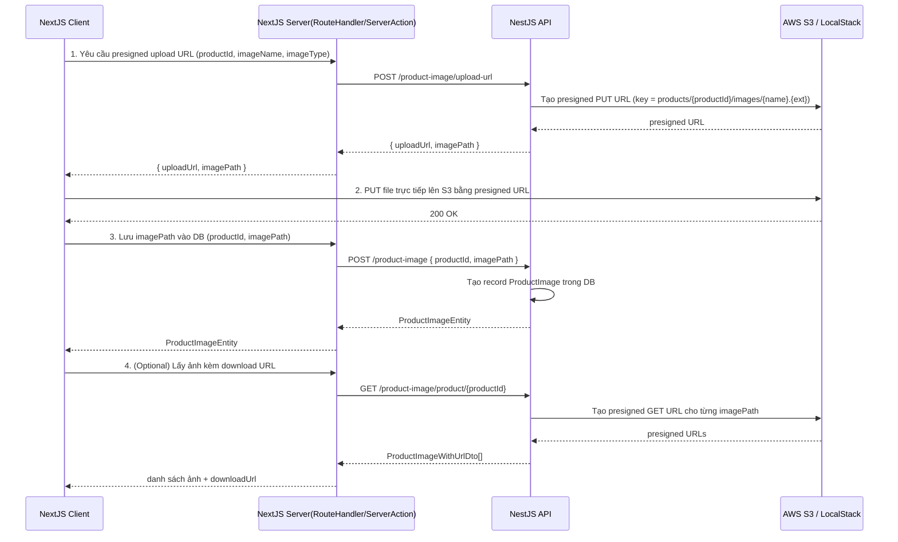

# Upload Image to S3 - Full Implementation Plan

## Tổng quan luồng (Flow)



## Chi tiết từng bước

### Bước 1 — Lấy presigned upload URL

**Endpoint NestJS:** `POST /product-image/upload-url`

Request body:

```typescript
{
  productId: string;   // UUID v4
  imageName: string;   // tên file không có extension, e.g. "product-front-view"
  imageType: string;   // "jpg" | "jpeg" | "png" | "webp" | "gif"
}
```

Response:

```typescript
{
  uploadUrl: string;  // presigned PUT URL, hết hạn sau 3600s
  imagePath: string;  // S3 key, e.g. "products/{productId}/images/product-front-view.jpg"
}
```

Logic NestJS (trong `generateProductImageUploadUrl`):

- Kiểm tra product tồn tại
- Validate imageType trong whitelist
- Build S3 key: `products/{productId}/images/{sanitizedName}.{ext}` (xem [`StorageService.buildProductImagePath`](src/common/services/storage.service.ts))
- Gọi `storageService.getUploadUrl(imagePath)` → dùng `PutObjectCommand` + `getSignedUrl` từ `@aws-sdk/s3-request-presigner`

### Bước 2 — Upload file trực tiếp lên S3 (phía Client)

Client dùng `fetch` hoặc `axios` để PUT file lên `uploadUrl`:

```typescript
await fetch(uploadUrl, {
  method: 'PUT',
  body: file,          // File object từ <input type="file">
  headers: {
    'Content-Type': file.type,
  },
});
```

Lưu ý quan trọng:

- Không thêm `Authorization` header (presigned URL đã tự authenticate)
- Không thêm `x-amz-checksum-*` header (server đã tắt checksum)

### Bước 3 — Lưu imagePath vào DB

**Endpoint NestJS:** `POST /product-image`

Request body:

```typescript
{
  productId: string;  // UUID v4
  imagePath: string;  // S3 key nhận được từ bước 1
}
```

Response: `ProductImageEntity`

```typescript
{
  id: string;
  productId: string;
  imagePath: string;  // S3 key được lưu trong DB
  createdAt: Date;
  updatedAt: Date;
  deletedAt: Date | null;
  createdById: string | null;
  updatedById: string | null;
}
```

Logic NestJS: Tạo record `ProductImage` trong Prisma với `{ productId, imagePath, createdById, updatedById }`.

### Bước 4 — Lấy ảnh với download URL (Optional)

**Endpoint NestJS:** `GET /product-image/product/{productId}`

Response: `ProductImageWithUrlDto[]`

```typescript
{
  id: string;
  productId: string;
  imagePath: string;      // S3 key
  downloadUrl: string;    // presigned GET URL, hết hạn sau 3600s
  createdAt: Date;
  updatedAt: Date;
}
```

Logic NestJS: Với mỗi `imagePath` trong DB, gọi `storageService.getDownloadUrl(imagePath)` → dùng `GetObjectCommand` + `getSignedUrl`.

## Cấu hình môi trường (AWS / LocalStack)

Các biến env cần thiết (tham chiếu [`src/config/env.ts`](src/config/env.ts)):

| Biến | Mô tả | Dev (LocalStack) |

|------|-------|-----------------|

| `AWS_REGION` | AWS region | `us-east-1` |

| `AWS_ACCESS_KEY_ID` | Access key | `test` |

| `AWS_SECRET_ACCESS_KEY` | Secret key | `test` |

| `AWS_S3_BUCKET` | Tên bucket | `ecommerce-local` |

| `AWS_S3_ENDPOINT` | Endpoint override | `http://localhost:4566` |

| `AWS_S3_FORCE_PATH_STYLE` | Force path style | `true` |

LocalStack bucket được tạo bởi [`scripts/localstack/s3_bootstrap.sh`](scripts/localstack/s3_bootstrap.sh), CORS được cấu hình qua [`scripts/localstack/cors-config.json`](scripts/localstack/cors-config.json).

## Implement trên Next.js

### Option A — Route Handler (App Router)

```
app/api/product-image/upload-url/route.ts   → gọi NestJS POST /product-image/upload-url
app/api/product-image/route.ts              → gọi NestJS POST /product-image
app/api/product-image/[productId]/route.ts  → gọi NestJS GET /product-image/product/{productId}
```

### Option B — Server Action

```typescript
// actions/product-image.ts
"use server"

export async function getUploadUrl(productId, imageName, imageType) { ... }
export async function saveImageRecord(productId, imagePath) { ... }
export async function getProductImages(productId) { ... }
```

### Lưu ý bảo mật

- Presigned URL chỉ valid trong 1 giờ (3600s)
- Bước 1 và 3 cần xác thực (Bearer token) theo RBAC của NestJS (`PRODUCT_IMAGE: CREATE`)
- Bước 4 cần permission `PRODUCT_IMAGE: LIST`
- Client PUT trực tiếp lên S3 mà không đi qua server → giảm tải server